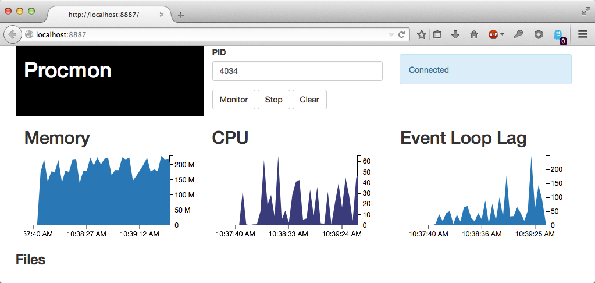

# Not maintained

# Procmon

Local process monitor with a web UI. Monitors and graphs memory, CPU and event loop lag.

Meant to be used in testing / staging environments.

Also exposes a public dir, which I find useful when producing tracing files.


## Install

```bash
$ npm install procmon -g
```

## Start

```bash
$ procmon-server
Procmon server PID (xxxx) listening on:
{"address":"0.0.0.0","family":"IPv4","port":8887}
```

## Monitor

Open a browser window and point it to http://hostname:8887



You can monitor CPU and memory by providing a PID and pressing the "Monitor" button.

## Monitor event loop lag

You can monitor the Node event loop lag on a target process by installing and requiring the [procmon-agent](https://github.com/pgte/node-procmon-agent) module on the project:

```bash
$ npm install procmon-agent
```

```javascript
require('procmon-agent')();
```

## Files

You can watch and retrieve files. For this you need to start the procmon server with the path of a public directory to be served:

```bash
$ procmon-server --public ../out
```

## License

ISC
